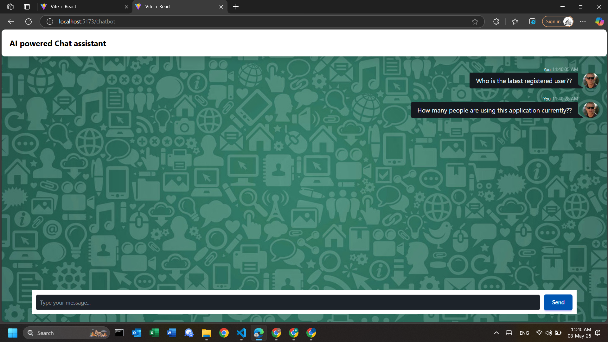

This is a full stack web application that allows user to authenthenticate their face to register into it, to access the AI powered chat assistant

Key features:
 -- Used OpenCV DNN and res10_300x300_ssd_iter_140000.caffemodel models for face recognition
 -- Used Gemini pro API to access data from registeration.txt (for prototype purposes) to answer the query from the text file
 -- In frontend, I used 3 main pages: 
        i. A Front Page
        ii. A face authentication page that asks access for camera to capture the image of user and send it to Mongo DB to register as new user
        iii. An AI assisted chat bot page to handle queries by accessing the database (But unable to integrate the RAG engine in front-end)
 --In backend created 3 end points:
    i.**Endpoint**: `/api/face-auth`
    - **Method**: `POST`
    - **Description**: Processes an uploaded image to detect and authenticate face.

    ii.**Endpoint**: `/uploads`
    - **Method**: `GET`
    - **Description**: Serves uploaded files from the `uploads` directory.
    
    iii. /register to Accept an image file (captured from the frontend).Process the image to extract face data. Store the face data and user information in the database.

I have added Screen shots for working of the application:

File Structure:
i. backend folder: All the backend code is present
ii. All frontend code is present in the root directory
iii. face auth folder: Contains the py file for face authentication implementation
iv. chat bot folder: Contains the RAG engine to process queries using Gemini API, Install packages inside requirements.txt folder

                                THANK YOU                              

This project is a part of a hackathon run by https://katomaran.com